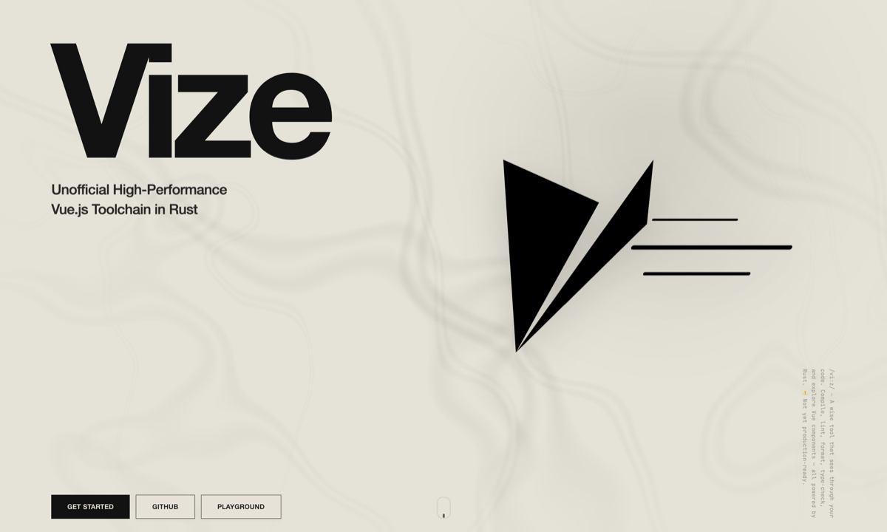

<p align="center">
  
</p>

<p align="center">
  <strong>Unofficial High-Performance Vue.js Toolchain in Rust</strong>
</p>

<p align="center">
  <em>/viːz/ — Named after Vizier + Visor + Advisor: a wise tool that sees through your code.</em>
</p>

<p align="center">
  <a href="https://vizejs.dev"><strong>Documentation</strong></a> ・
  <a href="https://vizejs.dev/play/"><strong>Playground</strong></a> ・
  <a href="https://github.com/sponsors/ubugeeei"><strong>Sponsor</strong></a>
</p>

> [!WARNING]
> Vize is under active development. APIs, package boundaries, and editor features are still moving.

> [!IMPORTANT]
> For day-to-day editor support, keep using the official Vue language tools (`vuejs/language-tools`) for now.
> Vize's VS Code extension, Zed extension, and `vize lsp` default to opt-in capabilities so teams can adopt them gradually.

## What Ships Today

- Rust workspace crates for parsing, semantic analysis, compilation, linting, formatting, type checking, LSP, Musea art tooling, and bindings
- A full Rust CLI via the `vize` crate (`build`, `fmt`, `lint`, `check`, `ready`, `upgrade`, `musea`, `lsp`, `ide`)
- npm packages including `@vizejs/vite-plugin`, `@vizejs/native`, `@vizejs/wasm`, `@vizejs/unplugin`, `@vizejs/rspack-plugin`, `@vizejs/nuxt`, `@vizejs/vite-plugin-musea`, `@vizejs/musea-mcp-server`, and `oxlint-plugin-vize`
- The `vize` npm package for shared config utilities and native `build`, `fmt`, `lint`, `check`, `ready`, and `upgrade` commands

## Quick Start

Need `vp` first? Install Vite+ once from the [Vite+ install guide](https://viteplus.dev/guide/install).

### Vite

```bash
vp install -D vize @vizejs/vite-plugin
```

```ts
// vite.config.ts
import { defineConfig } from "vite";
import vize from "@vizejs/vite-plugin";

export default defineConfig({
  plugins: [vize()],
});
```

```ts
// vize.config.ts
import { defineConfig } from "vize";

export default defineConfig({
  linter: {
    preset: "opinionated",
  },
  lsp: {
    lint: true,
    typecheck: false,
    editor: false,
    formatting: false,
  },
});
```

### npm CLI

The npm `vize` package exposes native CLI commands plus shared config helpers:

```bash
vp install -D vize
vp exec vize fmt --write src
vp exec vize lint src
vp exec vize check
vp exec vize build src
vp exec vize ready src
```

### Full Rust CLI

For the full native CLI, install the Rust binary:

```bash
cargo install vize
```

```bash
vize build src/**/*.vue
vize fmt --check src
vize lint --profile src
vize check --profile src
vize ready src
vize upgrade
vize lsp
```

You can also run the current workspace build directly:

```bash
nix run github:ubugeeei/vize#vize -- --help
```

## Static Analysis

Vize shares the same parser and semantic analysis layers across linting, type checking, editor
diagnostics, compilation, and Musea metadata.

```bash
vp exec vize lint --preset happy-path src
vp exec vize lint --preset essential --max-warnings 0 src
vp exec vize check src
```

Use the Rust CLI for the fuller project-backed type-checking surface:

```bash
vize check --tsconfig tsconfig.app.json
vize check --show-virtual-ts src/components/App.vue
vize check --declaration --declaration-dir dist/types
```

`vize lint` runs Patina rules for Vue templates, scripts, CSS, a11y, SSR, Vapor, Musea, cross-file,
and type-aware checks. Security-oriented Vue rules include `vue/no-unsafe-url`, which checks dynamic
URL bindings and static URL attributes for executable schemes such as `javascript:`, `vbscript:`,
and active `data:` payloads. `vize check` generates virtual TypeScript for Vue SFCs and maps project
diagnostics back to the original source files.

Use `vize lint --profile src` when tuning rule cost. Type-aware lint profile rows include template
query collection and Corsa probe phases so expensive cross-rule work can be spotted quickly.

## Compiler Configuration

The npm CLI and Vite plugin share `vize.config.*`:

```ts
import { defineConfig } from "vize";

export default defineConfig({
  compiler: {
    sourceMap: true,
    vapor: false,
    customRenderer: false,
  },
  vite: {
    scanPatterns: ["src/**/*.vue"],
  },
  linter: {
    preset: "happy-path",
  },
  typeChecker: {
    enabled: true,
    strict: true,
  },
});
```

Direct `vize()` options override shared config for Vite. See the docs for compiler options,
project scanning, lint presets, type-checker settings, and Musea config.

## Oxlint Integration

`oxlint-plugin-vize` lets Oxlint execute Vize Patina diagnostics through Oxlint's JS plugin system.

```bash
vp install -D oxlint oxlint-plugin-vize
vp exec oxlint-vize -c .oxlintrc.json -f stylish src
```

This keeps Oxlint's core JS and TS rules active while adding Vue-aware diagnostics under the `vize/*` namespace.

## Musea Component Gallery

Musea uses `*.art.vue` files to describe component variants with Vue-native syntax, then serves a
gallery through Vite.

```bash
vp install -D @vizejs/vite-plugin @vizejs/vite-plugin-musea vize
```

```ts
import { defineConfig } from "vite";
import vize from "@vizejs/vite-plugin";
import { musea } from "@vizejs/vite-plugin-musea";

export default defineConfig({
  plugins: [
    vize(),
    musea({
      include: ["src/**/*.art.vue"],
      basePath: "/__musea__",
      previewCss: ["src/styles/main.css"],
    }),
  ],
});
```

```bash
vp dev
vp exec musea-vrt --base-url http://localhost:5173 --ci --json
```

Use Musea for component documentation, prop palettes, design token views, accessibility audits,
visual regression snapshots, generated variants, and Storybook-compatible output.

## Editor Integration

Vize editor support is designed for incremental adoption alongside `vuejs/language-tools`.

Start with lint-only mode in VS Code:

```json
{
  "vize.enable": true,
  "vize.lint.enable": true,
  "vize.typecheck.enable": false,
  "vize.editor.enable": false,
  "vize.formatting.enable": false
}
```

Zed can enable the same capabilities through LSP initialization options:

```json
{
  "languages": {
    "Vue": {
      "language_servers": ["vize", "..."]
    }
  },
  "lsp": {
    "vize": {
      "initialization_options": {
        "lint": true
      }
    }
  }
}
```

The same feature names can be committed in `vize.config.json` or `vize.config.pkl` under `lsp`.

## Local Development

The primary local setup is `Nix + vp`.

```bash
nix develop
vp install --frozen-lockfile
vp check
vp fmt
vp dev
vp build
```

Useful workspace tasks:

```bash
vp check
vp fmt
vp dev
vp build
vp run --workspace-root check:fix
vp run --workspace-root bench:all
```

## Credits

This project draws inspiration from:
[Volar.js](https://github.com/volarjs/volar.js) ・
[vuejs/language-tools](https://github.com/vuejs/language-tools) ・
[eslint-plugin-vue](https://github.com/vuejs/eslint-plugin-vue) ・
[eslint-plugin-vuejs-accessibility](https://github.com/vue-a11y/eslint-plugin-vuejs-accessibility) ・
[Lightning CSS](https://github.com/parcel-bundler/lightningcss) ・
[Storybook](https://github.com/storybookjs/storybook) ・
[OXC](https://github.com/oxc-project/oxc)

## Sponsors

Vize is maintained by [@ubugeeei](https://github.com/ubugeeei). If you find it useful, please consider
[sponsoring](https://github.com/sponsors/ubugeeei).

## License

[MIT](./LICENSE)
